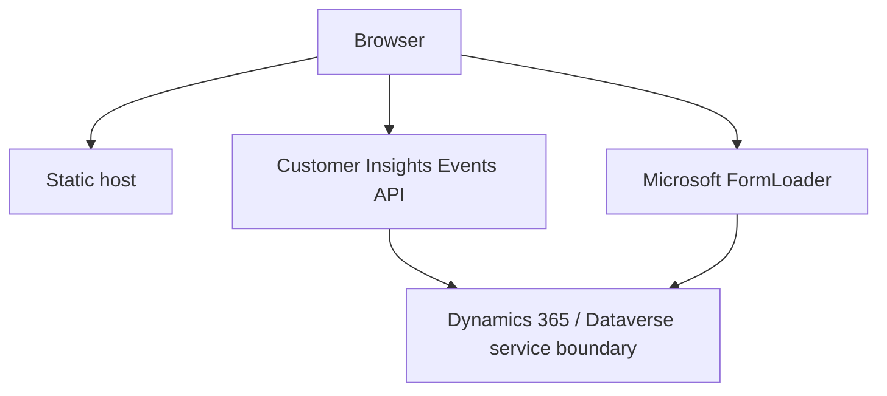

# Customer Insights Journeys Event Web Portal

A small, static event portal based on Microsoft's Customer Insights - Journeys web-application sample. It lists published events, renders event details, sessions and speakers, and embeds the associated Microsoft registration form.

This repository is deliberately independent from `contosocorpde` and contains no code, branding or architectural assumptions from that project.

## What is implemented

- Plain HTML, CSS and browser JavaScript; no Astro application
- Published-event list with search and sorting
- Event detail pages with optional agenda and speakers
- Microsoft-hosted event registration forms
- Light, dark and system themes
- English, German, Italian, French, Spanish, Portuguese, Polish and Czech UI/content localization
- Automated event/form translation synchronization
- Local Express development server
- Static GitHub Pages deployment workflow

There is currently **no application backend**, Cloudflare Worker, Dataverse Web API client, Entra ID login, magic link, session, cookie-based authentication or custom `/api/*` endpoint. The browser calls the public Customer Insights - Journeys Events API directly. See [Architecture](docs/ARCHITECTURE.md) and [API](docs/API.md).

## Architecture at a glance



The Events API web-application token and organization ID are browser configuration, not confidential server credentials. They are visible to every visitor at runtime. Never place an Entra client secret, Dataverse bearer token, password or other true secret in `public/` or a client-side build variable.

## Tech stack

- Browser: HTML, CSS, JavaScript
- Microsoft: Customer Insights - Journeys public Events API and FormLoader
- Local tooling: Node.js 22+, Express 5
- Automation: GitHub Actions and Python 3.12/`googletrans` for translation synchronization
- Hosting configured in this repository: GitHub Pages

## Prerequisites

- Node.js 22 or newer
- A Customer Insights - Journeys web application record
- The local/production origin registered on that web application for CORS
- The hosting domain allowed for external form hosting

Microsoft's current setup guide is [Create an event portal using the web application](https://learn.microsoft.com/en-us/dynamics365/customer-insights/journeys/developer/event-portal-web-application).

## Local development

```bash
git clone https://github.com/ganfer/CIJ-Event-WebAPI.git
cd CIJ-Event-WebAPI
npm ci
cp public/js/config.example.js public/js/config.js
npm start
```

Edit `public/js/config.js` before starting:

```javascript
const CONFIG = {
    BASE_URL: "https://public-eur.mkt.dynamics.com",
    ORG_ID: "your-organization-id",
    TOKEN: "your-web-application-token",
    WEBAPP_ID: ""
};
```

Open `http://localhost:3000`. Register `http://localhost:3000` as the web-application origin in Customer Insights - Journeys.

`public/js/config.js` is intentionally ignored by Git and excluded from `_site/` builds. Do not force-add it.

## Commands

```bash
npm ci
npm start
npm run check
npm test
npm run build
npm audit --omit=dev
```

| Command | Purpose |
| --- | --- |
| `npm start` | Start the local-only server on port 3000 |
| `npm run check` | Validate JavaScript syntax, JSON, locales and local asset references |
| `npm test` | Run unit/integration tests plus project and theme checks |
| `npm run build` | Create the deployable `_site/` directory without local `config.js` |
| `npm run check:translations` | Compare live published events with committed translation files; requires API environment variables |

Use `npm install` only when intentionally changing dependencies; use `npm ci` for reproducible installation.

## Configuration

GitHub Actions uses:

| Name | Required | Purpose |
| --- | --- | --- |
| `EVENTS_BASE_URL` | No | Events API origin; defaults to the public European endpoint |
| `EVENTS_ORG_ID` | Yes | Customer Insights organization ID |
| `EVENTS_API_TOKEN` | Yes | Web-application token sent by browser requests |
| `EVENTS_WEBAPP_ID` | No | Restrict the published event list to one web application |

Although stored as a GitHub Actions secret to keep environment-specific values out of Git history, `EVENTS_API_TOKEN` becomes public inside the deployed browser configuration. Details and trust rules are in [Configuration](docs/CONFIGURATION.md) and [Security](docs/SECURITY.md).

## Tests and build

```bash
npm ci
npm test
npm run build
npm audit --omit=dev --audit-level=high
```

Live translation validation additionally requires `EVENTS_ORG_ID` and `EVENTS_API_TOKEN` and is performed in CI where configured.

## Deployment

The `Deploy GitHub Pages` workflow builds `_site/`, injects environment-specific `js/config.js` into that artifact, smoke-tests the Events API and deploys on pushes to `main`.

For this repository, the default Pages URL is:

`https://ganfer.github.io/CIJ-Event-WebAPI/`

The registered CORS origin is `https://ganfer.github.io` because an origin never contains the repository path.

The site is also compatible with other static hosts. `public/_headers` supplies baseline headers on hosts that support the Cloudflare/Netlify headers-file convention; GitHub Pages ignores that file. See [Deployment](docs/DEPLOYMENT.md).

## Documentation

Start with [docs/START.md](docs/START.md). It links to:

- [Architecture and data flows](docs/ARCHITECTURE.md)
- [Implemented and external API calls](docs/API.md)
- [Authentication reality](docs/AUTHENTICATION.md)
- [Dynamics and Dataverse integration](docs/DYNAMICS.md)
- [Security model](docs/SECURITY.md)
- [Development](docs/DEVELOPMENT.md), [testing](docs/TESTING.md), [deployment](docs/DEPLOYMENT.md) and [troubleshooting](docs/TROUBLESHOOTING.md)
- [Repository audit and remaining risks](docs/AUDIT.md)

## Security reporting

Do not publish credentials, attendee data or production configuration in an issue. Rotate any accidentally exposed true secret immediately. The repository intentionally contains only a blank configuration template.

## Microsoft resources

- [Create an event portal using the web application](https://learn.microsoft.com/en-us/dynamics365/customer-insights/journeys/developer/event-portal-web-application)
- [Extend Customer Insights - Journeys marketing forms using code](https://learn.microsoft.com/en-us/dynamics365/customer-insights/journeys/developer/realtime-marketing-form-client-side-extensibility)
- [Authenticate and allow domains](https://learn.microsoft.com/en-us/dynamics365/customer-insights/journeys/domain-authentication)

## License

See [LICENSE](LICENSE).
