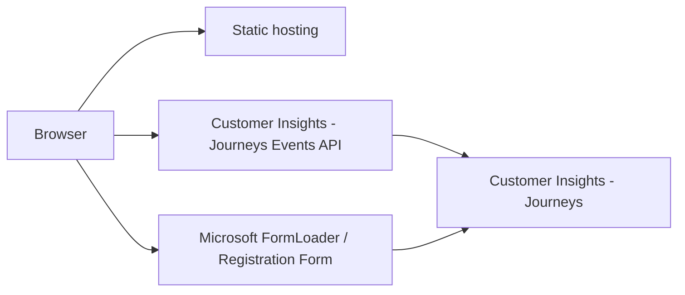
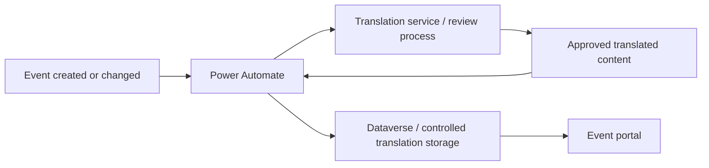
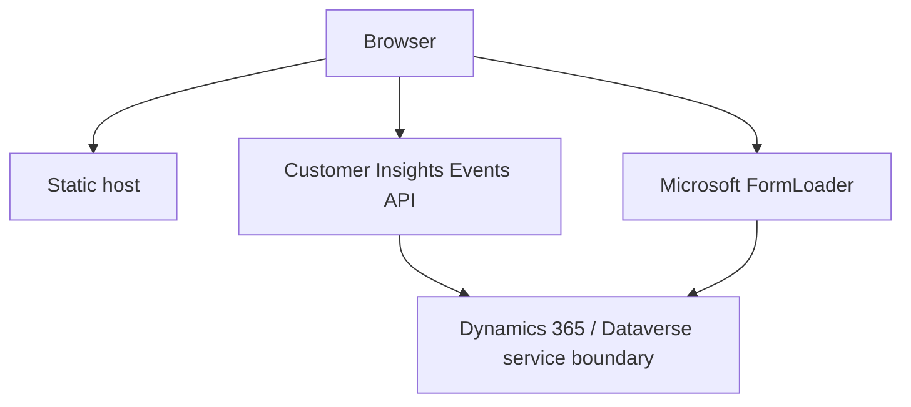

# Customer Insights Journeys Event Web Portal

A customized event portal for **Microsoft Dynamics 365 Customer Insights - Journeys**, based on Microsoft's official event web-application sample and the public Customer Insights - Journeys Events API.

This repository keeps the core Microsoft event-portal approach, but adds design changes, usability improvements, localization support, tests, deployment automation and additional documentation.

> [!IMPORTANT]
> This project is an **independent fork/adaptation of Microsoft's official sample files**. It is not an official Microsoft product and is not supported by Microsoft. The underlying event API, registration behavior and platform limits are defined by Microsoft Customer Insights - Journeys.

Microsoft documentation:

- [Use the event API in real-time journeys](https://learn.microsoft.com/en-us/dynamics365/customer-insights/journeys/developer/using-rtm-event-api)
- [Create an event portal using the web application](https://learn.microsoft.com/en-us/dynamics365/customer-insights/journeys/developer/event-portal-web-application)
- [Create a Customer Insights - Journeys segment using the Web API](https://learn.microsoft.com/en-us/dynamics365/customer-insights/journeys/real-time-marketing-api-segment)

---

## What this project is

The portal is a static browser application that communicates directly with the public Customer Insights - Journeys Events API.

It can be used as a starting point for a branded event portal without building a complete custom backend.

The current implementation provides:

- a searchable event overview
- dynamically loaded event detail pages
- event title, description, date, time and location
- sessions and agenda information where available
- speaker information where available
- Microsoft-hosted registration forms
- light, dark and system themes
- responsive layout and design adjustments compared with the Microsoft sample
- support for multiple UI languages
- optional per-event and per-form translation files
- automated validation and CI checks
- GitHub Pages deployment

The Microsoft Events API itself can expose more than the portal currently renders, including event data, sessions, session tracks, passes, speakers, sponsorships and registration operations. Microsoft also supports custom event and session registrations directly through the API if you decide to replace the embedded Microsoft form with your own registration experience.

## Origin of this repository

This repository is based on the downloadable **Microsoft Customer Insights - Journeys event web-application sample** described in the official Microsoft documentation.

The intention is deliberately conservative: the Microsoft sample architecture and Events API remain the foundation, while this repository adds presentation, usability, localization, testing and deployment improvements around it.

The project should therefore be understood as:

**Microsoft sample / Events API + independent design and developer-experience improvements**

It is not intended to reimplement Customer Insights - Journeys, Dataverse or the Microsoft registration service.

## Architecture



There is currently no custom production backend in this repository.

The browser receives the web-application token and organization information required by the Events API. These values must therefore be considered **browser-visible configuration**, not confidential server-side credentials.

Never place Entra client secrets, Dataverse OAuth tokens, passwords, private keys or other true secrets in the frontend configuration.

---

# Language and translation concept

The language functionality in this repository is an **extension of the Microsoft sample** and should be treated independently from the Events API itself.

The portal currently supports:

- English
- German
- Italian
- French
- Spanish
- Portuguese
- Polish
- Czech

The language switcher intentionally displays language names rather than country flags because a language is not equivalent to a country or nationality.

Two different types of text have to be considered:

1. **Portal UI text** such as buttons, labels, loading messages and navigation.
2. **Business content** such as event titles, descriptions, sessions, speakers and registration-form text.

Portal UI translations are stored in the repository. Event and form translations can additionally be stored in dedicated translation files.

## Important recommendation for production environments

> [!WARNING]
> The repository-based translation automation is useful for demos, development and reference implementations, but it is **not the recommended translation architecture for a production Customer Insights environment**.

For productive implementations, the recommended approach is to manage the translation process through **Power Automate** and controlled Dataverse/Customer Insights data rather than relying on automated repository translations.

A production-oriented pattern can look like this:



Power Automate is preferable in production because it can provide:

- controlled triggers when events or sessions change
- environment-specific configuration
- approval workflows
- human review before translations become public
- error handling and retry logic
- auditability
- integration with enterprise translation services
- clear separation between source content and translated content
- lifecycle management without requiring a code commit for every content change

The translation files and synchronization scripts in this repository should therefore primarily be considered a **demo/reference implementation**.

Machine translations should never automatically become legally, commercially or compliance-relevant production content without an appropriate validation process.

---

# What can be built with the Events API?

According to Microsoft, the real-time journeys Events API can be used to build a completely customized event page or event portal.

Typical scenarios include:

- list live and published events
- display event names and descriptions
- show event start and end times
- show physical or virtual locations
- display event QR codes
- show event capacity
- retrieve sessions
- retrieve speakers
- retrieve sponsors and sponsor logos
- create custom event registration experiences
- create event registrations without using a real-time marketing form
- register attendees for specific sessions
- create waitlist registrations

For custom registration submissions, Customer Insights - Journeys can still apply platform functionality such as matching strategy, audience configuration and compliance settings.

This repository currently uses the Microsoft-hosted registration form rather than implementing a custom registration submission endpoint.

---

# Events API behavior and limits

The Events API is designed for public event scenarios, but it is important to understand that it is not a generic Dataverse API.

## Published events only

The portal can only retrieve events that are live/published for the corresponding web application configuration.

An event that exists in Dataverse but is not published correctly will not automatically appear in the portal.

## Origin / CORS restrictions

When creating the Customer Insights web application, the correct browser origin must be registered.

For example:

```text
https://events.example.com
```

The origin does not contain a page path.

A different hostname, protocol or port is a different origin and can therefore be rejected by CORS.

## Registration processing is asynchronous

Microsoft processes high-volume Event API registrations asynchronously.

A successful API response means that the request was accepted for processing. It does **not necessarily mean that all underlying Dataverse records have already been created when the response is returned**.

## 10-minute validation cache

Microsoft applies a **10-minute read cache** for event and related-entity validation.

This improves throughput but means that some configuration changes may not be reflected immediately during validation.

The cache applies to validation data, not to the registration records themselves.

## Retry window

If the background registration processor cannot create the required registration records, Microsoft automatically retries processing for **up to six hours**.

Applications should therefore avoid assuming that an accepted request and the final Dataverse state are always synchronized immediately.

## Dataverse service protection

Microsoft documents Dataverse service-protection limits as an important throughput constraint for custom registration scenarios.

Under normal conditions, Dataverse can enforce a limit of approximately **6,000 API requests within a five-minute sliding window per user and web server**.

If service-protection limits are exceeded, the platform can return:

```text
429 Too Many Requests
```

Clients should respect retry information and avoid aggressive polling or uncontrolled retry loops.

## Payment scenarios

Microsoft notes that events using payment gateways can require additional validation and may have lower effective throughput.

Always load-test and validate the complete registration process if payment is involved.

## API contract and future changes

Customer Insights provides an OpenAPI specification for the configured Events API endpoint. Use that contract as the authoritative source for the environment you are integrating with.

Do not assume that undocumented fields or behavior will remain stable.

---

# Event API vs. Dataverse Web API vs. Segment API

These APIs solve different problems and should not be mixed conceptually.

| API | Main purpose | Used directly by this portal? |
| --- | --- | --- |
| Customer Insights Events API | Public event information and event/session registrations | Yes |
| Microsoft FormLoader | Render and submit Microsoft-hosted registration forms | Yes |
| Dataverse Web API | General authenticated access to Dataverse tables and actions | No |
| Customer Insights Segment Web API | Create, edit, publish and inspect Customer Insights segments | No |

The Events API is suitable for a public event frontend because it is explicitly designed for the web-application scenario.

The Dataverse Web API and segment actions normally require proper server-side authentication and must **not** be exposed by placing OAuth credentials in browser JavaScript.

---

# Segment API capabilities and limits

The Microsoft segment documentation linked above is relevant when an implementation also wants to automate Customer Insights - Journeys segments through the Dataverse Web API.

It is not required for the event portal itself.

The Segment Web API can be used to:

- create segment definitions
- create Customer Insights segments
- define dynamic queries
- manage static members
- publish segments
- list segment members
- stop live segments

Important limits documented by Microsoft include:

- a segment definition can contain at most **10 static member groups**
- one `AddStaticMembers` request can contain at most **1,000 entity IDs**
- one static member group can contain at most **200,000 entity IDs** in total
- Microsoft currently documents **contacts and leads** as supported Customer Insights - Journeys segment member types
- a segment cannot simply be stopped while active journeys or dependent active segments still require it

If segment automation is added to this project in the future, it should be implemented through a secure backend, Power Automate, Azure Function, Cloudflare Worker or another controlled server-side component with proper Dataverse authentication.

Do not call authenticated Dataverse segment operations directly from public browser JavaScript.

---

# Recommended use cases

This repository is a good fit for:

- proof-of-concept event portals
- demo environments
- branded public event listings
- replacing the visual appearance of the Microsoft sample portal
- learning how the Events API works
- creating a starting point for a larger event solution

For production implementations, additionally evaluate:

- security and privacy requirements
- accessibility
- organizational branding standards
- consent requirements
- translation governance
- monitoring and observability
- registration volume
- retry behavior
- custom domain and HTTP security headers
- availability requirements
- payment requirements
- backend requirements for protected or personalized functionality

---

# Quick start

```bash
git clone https://github.com/ganfer/CIJ-Event-WebAPI.git
cd CIJ-Event-WebAPI
npm ci
cp public/js/config.example.js public/js/config.js
npm start
```

Configure `public/js/config.js` with the values of the Customer Insights - Journeys web application.

```javascript
const CONFIG = {
    BASE_URL: "https://public-eur.mkt.dynamics.com",
    ORG_ID: "your-organization-id",
    TOKEN: "your-web-application-token",
    WEBAPP_ID: ""
};
```

Then open:

```text
http://localhost:3000
```

The local origin must be configured in Customer Insights - Journeys if the browser is expected to access the Events API from localhost.

## Validation

```bash
npm run check
npm test
npm run build
npm audit --omit=dev
```

Detailed documentation is available in [`docs/START.md`](docs/START.md).

---

# Previous README

The previous project README is intentionally preserved below so that existing setup, deployment and architecture information remains available.

---

# Customer Insights Journeys Event Web Portal

A small, static event portal based on Microsoft's Customer Insights - Journeys web-application sample. It lists published events, renders event details, sessions and speakers, and embeds the associated Microsoft registration form.

This repository is deliberately independent from `contosocorpde` and contains no code, branding or architectural assumptions from that project.

## What is implemented

- Plain HTML, CSS and browser JavaScript; no Astro application
- Published-event list with search and sorting
- Event detail pages with optional agenda and speakers
- Microsoft-hosted event registration forms
- Light, dark and system themes
- English, German, Italian, French, Spanish, Portuguese, Polish and Czech UI/content localization
- Automated event/form translation synchronization
- Regression tests for long web-application tokens and the Microsoft form embed
- Local Express development server
- Static GitHub Pages deployment workflow

There is currently **no application backend**, Cloudflare Worker, Dataverse Web API client, Entra ID login, magic link, session, cookie-based authentication or custom `/api/*` endpoint. The browser calls the public Customer Insights - Journeys Events API directly. See [Architecture](docs/ARCHITECTURE.md) and [API](docs/API.md).

## Architecture at a glance



The Events API web-application token and organization ID are browser configuration, not confidential server credentials. They are visible to every visitor at runtime. Never place an Entra client secret, Dataverse bearer token, password or other true secret in `public/` or a client-side build variable.

## Tech stack

- Browser: HTML, CSS, JavaScript
- Microsoft: Customer Insights - Journeys public Events API and FormLoader
- Local tooling: Node.js 22+, Express 5
- Automation: GitHub Actions and Python 3.12/`googletrans` for translation synchronization
- Hosting configured in this repository: GitHub Pages

## Prerequisites

- Node.js 22 or newer
- A Customer Insights - Journeys web application record
- The local/production origin registered on that web application for CORS
- The hosting domain allowed for external form hosting

Microsoft's current setup guide is [Create an event portal using the web application](https://learn.microsoft.com/en-us/dynamics365/customer-insights/journeys/developer/event-portal-web-application).

## Local development

```bash
git clone https://github.com/ganfer/CIJ-Event-WebAPI.git
cd CIJ-Event-WebAPI
npm ci
cp public/js/config.example.js public/js/config.js
npm start
```

Edit `public/js/config.js` before starting:

```javascript
const CONFIG = {
    BASE_URL: "https://public-eur.mkt.dynamics.com",
    ORG_ID: "your-organization-id",
    TOKEN: "your-web-application-token",
    WEBAPP_ID: ""
};
```

Open `http://localhost:3000`. Register `http://localhost:3000` as the web-application origin in Customer Insights - Journeys.

`public/js/config.js` is intentionally ignored by Git and excluded from `_site/` builds. Do not force-add it.

## Commands

```bash
npm ci
npm start
npm run check
npm test
npm run build
npm audit --omit=dev
```

| Command | Purpose |
| --- | --- |
| `npm start` | Start the local-only server on port 3000 |
| `npm run check` | Validate JavaScript syntax, JSON, locales and local asset references |
| `npm test` | Run unit/integration tests plus project and theme checks |
| `npm run build` | Create the deployable `_site/` directory without local `config.js` |
| `npm run check:translations` | Compare live published events with committed translation files; requires API environment variables |

Use `npm install` only when intentionally changing dependencies; use `npm ci` for reproducible installation.

## Configuration

GitHub Actions uses:

| Name | Required | Purpose |
| --- | --- | --- |
| `EVENTS_BASE_URL` | No | Events API origin; defaults to the public European endpoint |
| `EVENTS_ORG_ID` | Yes | Customer Insights organization ID |
| `EVENTS_API_TOKEN` | Yes | Web-application token sent by browser requests |
| `EVENTS_WEBAPP_ID` | No | Restrict the published event list to one web application |

Although stored as a GitHub Actions secret to keep environment-specific values out of Git history, `EVENTS_API_TOKEN` becomes public inside the deployed browser configuration. Details and trust rules are in [Configuration](docs/CONFIGURATION.md) and [Security](docs/SECURITY.md).

## Tests and build

```bash
npm ci
npm test
npm run build
npm audit --omit=dev --audit-level=high
```

Live translation validation additionally requires `EVENTS_ORG_ID` and `EVENTS_API_TOKEN` and is performed in CI where configured.

## Deployment

The `Deploy GitHub Pages` workflow builds `_site/`, injects environment-specific `js/config.js` into that artifact, smoke-tests the Events API and deploys on pushes to `main`.

For this repository, the default Pages URL is:

`https://ganfer.github.io/CIJ-Event-WebAPI/`

The registered CORS origin is `https://ganfer.github.io` because an origin never contains the repository path.

The site is also compatible with other static hosts. GitHub Pages does not support repository-defined response headers, so stronger production headers require a controllable proxy/CDN or another static host. See [Deployment](docs/DEPLOYMENT.md).

## Documentation

Start with [docs/START.md](docs/START.md). It links to:

- [Architecture and data flows](docs/ARCHITECTURE.md)
- [Implemented and external API calls](docs/API.md)
- [Authentication reality](docs/AUTHENTICATION.md)
- [Dynamics and Dataverse integration](docs/DYNAMICS.md)
- [Security model](docs/SECURITY.md)
- [Development](docs/DEVELOPMENT.md), [testing](docs/TESTING.md), [deployment](docs/DEPLOYMENT.md) and [troubleshooting](docs/TROUBLESHOOTING.md)
- [Repository audit and remaining risks](docs/AUDIT.md)

## Security reporting

Do not publish credentials, attendee data or production configuration in an issue. Rotate any accidentally exposed true secret immediately. The repository intentionally contains only a blank configuration template.

## Microsoft resources

- [Create an event portal using the web application](https://learn.microsoft.com/en-us/dynamics365/customer-insights/journeys/developer/event-portal-web-application)
- [Extend Customer Insights - Journeys marketing forms using code](https://learn.microsoft.com/en-us/dynamics365/customer-insights/journeys/developer/realtime-marketing-form-client-side-extensibility)
- [Authenticate and allow domains](https://learn.microsoft.com/en-us/dynamics365/customer-insights/journeys/domain-authentication)

## License

See [LICENSE](LICENSE).
