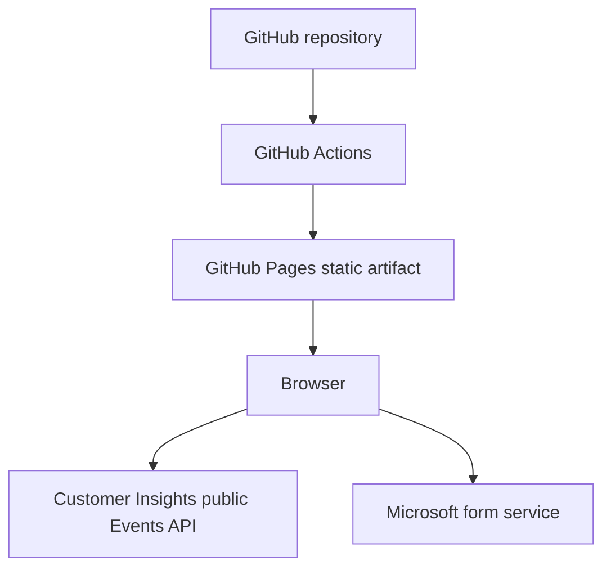
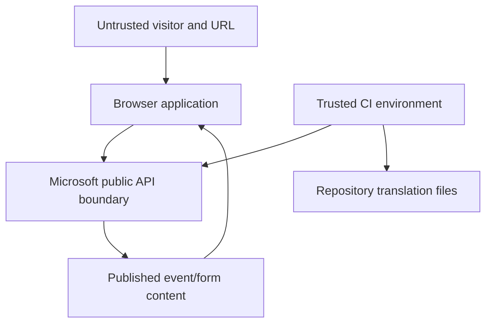

# Architecture

## Current state

The production application is a static site. HTML, CSS, authored JavaScript, the vendored Microsoft Events SDK, locale files and generated translation JSON are deployed together. The visitor's browser performs all runtime API calls.

Customer Insights is backed by Dynamics 365/Dataverse, but that internal implementation is behind Microsoft's service boundary. Repository code does not call the Dataverse Web API and does not obtain Entra OAuth tokens.

## Components

| Component | Runtime | Responsibility |
| --- | --- | --- |
| Static host | GitHub Pages today | Delivers files; performs no application logic |
| Event pages | Browser | Render list/details, search, sort, themes and translations |
| API wrapper | Browser | Validates configuration/IDs, applies a 15-second timeout and calls Microsoft SDK |
| `PublicApi.bundle.js` | Browser | Vendored Microsoft Events API client generated from an OpenAPI definition |
| FormLoader | Browser + Microsoft | Fetches, renders and submits the event registration form |
| Express server | Local Node process | Serves `public/` for development only |
| Translation workflow | GitHub Actions | Reads published event/form content, sends source text to `googletrans`, validates and commits JSON |

## Trust boundaries

- URL parameters, API payloads and form embed markup are untrusted input to rendering code.
- The browser and everything delivered to it are public.
- GitHub Actions can read configured repository secrets and write translation content to `main`.
- Microsoft hosts receive event API requests and registration data.
- Google Translate (through the unofficial `googletrans` client) receives source event/form text during synchronization, but not attendee submissions.

## Runtime data flows

### Published event list

1. Browser downloads `index.html`, scripts, styles and `config.js`.
2. `api-wrapper.js` validates HTTPS/Dynamics host configuration.
3. The SDK sends `GET .../events/published?emApplicationtoken=...` and optional filters.
4. The browser loads per-event translation JSON when present.
5. `event-grid.js` renders only required card fields.

### Event details

1. `event-details.html?id={readableEventId}` supplies an untrusted query value.
2. The ID is trimmed, bounded and rejected if it contains control characters.
3. The browser requests event details.
4. Rich text is parsed with an element/attribute allowlist.
5. HTTPS images use `Referrer-Policy: no-referrer`.
6. Optional sessions and speakers load without blocking the core page.

### Registration

1. The event response contains a Microsoft form placeholder and loader URL.
2. The app discards arbitrary returned elements, inline code and event-handler attributes.
3. It rebuilds a minimal placeholder with approved attributes and HTTPS Dynamics URLs.
4. It loads only an approved Microsoft/Azure CDN FormLoader path.
5. FormLoader fetches and submits the form directly to Microsoft.

### Translation automation

1. Scheduled/manual GitHub workflow checks out `main`.
2. Node scripts call the published-events, event, sessions and speakers endpoints.
3. Cached form URLs are fetched only after HTTPS/Microsoft-host/path validation and with timeouts.
4. Python scripts translate English source text into the eight supported locales.
5. Tests/build/translation validation run before the bot commits generated files.

## Browser exposure

Browser-visible data includes the organization ID, web-application token, optional webapp ID, published events, sessions, speakers, form definitions, localized content and data a visitor enters into the form. The portal itself does not store submitted form values.

CI-only values and repository credentials remain outside the artifact, except that the web-application token is deliberately materialized into `config.js` because the Microsoft static reference architecture requires it client-side.

## Cloudflare separation

### Current Cloudflare-specific code

None. There is no Worker runtime, Pages Function, KV, D1, R2, Cache API, Wrangler configuration or binding. `public/_headers` is a portable static-host convention understood by Cloudflare Pages; it is not Worker business logic.

### Portable business/presentation logic

Rendering, localization, filtering, identifier normalization and URL policy are plain JavaScript. Static hosting can move unchanged to Azure Static Web Apps, object storage/CDN, Nginx, Apache or another static platform.

### If a backend is introduced

A Node service, Docker container, Azure Function, Azure App Service or Cloudflare Worker would need adapters for:

- environment/secret access;
- HTTP routing and responses;
- outbound request timeouts/retries;
- rate limiting and durable replay protection;
- logging/observability;
- session storage if user authentication is added;
- static asset delivery or a separate frontend origin.

The current browser renderer can remain, but its data source should be replaced by the backend contract. Registration forms require special design because Microsoft's FormLoader still communicates from the browser with Microsoft endpoints.

## Recommended state (only when requirements demand it)

Keep the static architecture for public published events. Add a backend-for-frontend only when confidential data, user identity, server-held Dataverse credentials, authorization, custom writes or abuse controls are required. This is a recommendation, not the current implementation.
