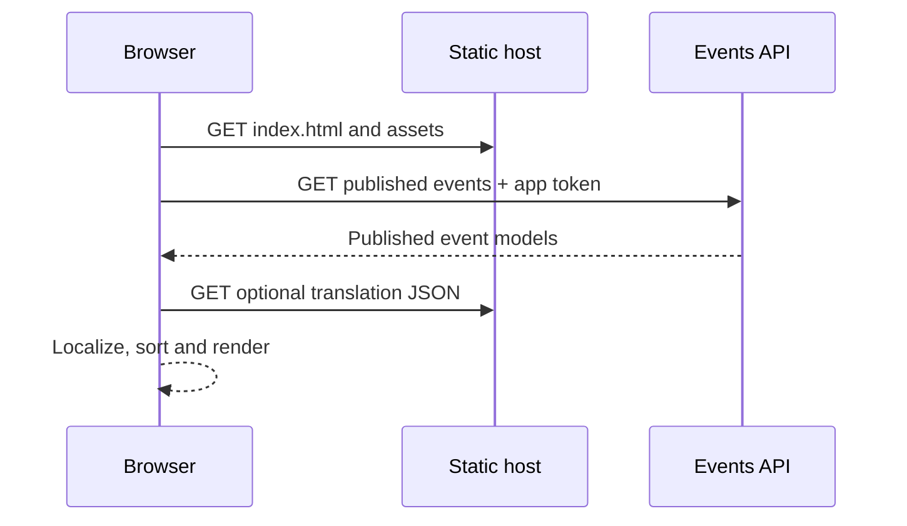
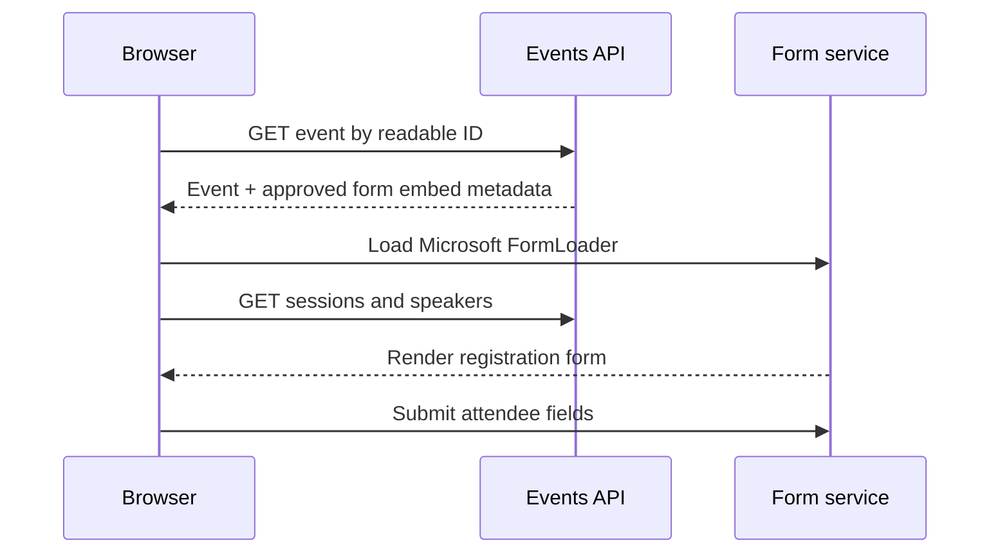

# Start here

This is the practical entry point for developers, consultants and administrators who are new to the Event Web Portal.

## 1. What the application is

The portal presents live Customer Insights - Journeys events on a separately hosted website. Visitors can search the published list, open an event, read its details and submit the Microsoft-hosted registration form.

It is an enhanced version of Microsoft's downloadable event web-application sample. The implementation intentionally stays small: the production artifact is a directory of static files.

## 2. The most important architectural fact

All application logic currently runs in the browser. There is no custom production backend in this repository.

| Present | Not present |
| --- | --- |
| Static HTML/CSS/JavaScript | Astro |
| Microsoft Events API SDK | Cloudflare Worker or Pages Function |
| Browser-to-Events-API requests | Custom `/api/*` routes |
| Microsoft FormLoader | Entra ID application authentication |
| Local Express static server | Magic links, sessions or login cookies |
| GitHub Actions | Direct Dataverse Web API queries |

`server.js` only makes local development convenient. It is not involved when the GitHub Pages site runs.

## 3. Browser JavaScript versus server JavaScript

Browser JavaScript is downloaded to a visitor's device. A visitor can inspect it, change it locally, call functions manually and read every value it uses. Therefore client code must always be treated as public and untrusted.

Server JavaScript runs in a controlled runtime such as a Cloudflare Worker, Node.js service or Azure Function. It can hold secrets and enforce authorization because visitors cannot directly inspect or modify its process memory.

This project has browser JavaScript under `public/js/`. The Node scripts under `scripts/`, GitHub workflows and local `server.js` run outside the visitor's browser, but none of them is a production application backend.

## 4. Why the browser talks directly to Customer Insights

Microsoft's web-application model is designed for a static site. A Customer Insights administrator creates a web application record with an allowed origin and an automatically generated token. The browser sends that token as `emApplicationtoken` to the public Events API. The API's CORS policy checks the browser origin.

This web-application token is visible in browser developer tools and in deployed `js/config.js`. It is not equivalent to an Entra client secret or a Dataverse bearer token. GitHub stores it as an Actions secret only to keep environment-specific configuration out of repository history.

If future requirements include confidential events, user-specific data, role-based authorization, portal accounts or hidden credentials, the architecture must gain a real backend. Merely moving a token into a build-time environment variable does not make it secret.

## 5. What are Dataverse and Entra ID?

Dataverse is the data platform used by Dynamics 365 and Customer Insights - Journeys. Event definitions and registrations ultimately live inside Microsoft's service boundary backed by Dataverse.

Microsoft Entra ID can issue OAuth access tokens to applications that call the Dataverse Web API. This repository does not do that. It neither contains an Entra tenant/client ID nor uses a client secret. The public Events API and FormLoader are the only runtime integration surfaces.

## 6. Typical request flows

### Event list



### Event details and registration



The portal renders the event before optional session and speaker requests complete. A failure in optional data therefore does not block event details or registration.

## 7. Events and registrations

Only events returned by the configured published-events endpoint appear. In Customer Insights - Journeys, the event must be live and published to the intended web application.

The app reads event metadata, a detail model, sessions and speakers. It does not implement its own registration endpoint. It validates the form placeholder and Microsoft FormLoader URL from the event response, then lets Microsoft's loader fetch and submit the form. Cancellation, re-registration, session selection and attendee portal functions are not implemented by repository code.

## 8. Portal authentication

There is no visitor account, authentication, magic link, session or logout flow. Every event returned by the public endpoint is public to the configured web application. The application token identifies the web application configuration; it does not identify the visitor.

See [AUTHENTICATION.md](AUTHENTICATION.md) before adding any authenticated functionality.

## 9. Get the project running

Requirements:

- Git
- Node.js 22 or newer
- A Customer Insights - Journeys web application record

Commands:

```bash
git clone https://github.com/ganfer/CIJ-Event-WebAPI.git
cd CIJ-Event-WebAPI
npm ci
cp public/js/config.example.js public/js/config.js
```

Fill in `public/js/config.js`, then run:

```bash
npm start
```

Open `http://localhost:3000`. Customer Insights must allow that exact origin. External form hosting must allow `localhost` if the registration form is tested locally.

PowerShell equivalent:

```powershell
Copy-Item public/js/config.example.js public/js/config.js
npm start
```

## 10. Validate and build

```bash
npm run check
npm test
npm run build
npm audit --omit=dev
```

`npm run build` creates `_site/`. Local `public/js/config.js` is deliberately excluded. A deployment workflow creates `_site/js/config.js` from its environment.

Live translation validation is separate because it needs Customer Insights configuration:

```bash
EVENTS_ORG_ID='...' EVENTS_API_TOKEN='...' npm run check:translations
```

Do not paste real values into documentation, tests, commits or terminal output shared with others.

## 11. Configure another environment

1. Create a Customer Insights - Journeys web application record for the new origin.
2. Allow the origin through that web application record.
3. Allow the hostname for external form hosting.
4. Set `BASE_URL`, `ORG_ID`, `TOKEN` and optionally `WEBAPP_ID` in local `config.js` or deployment settings.
5. Publish at least one event to the web application.
6. Run the API/deployment smoke test.

Production and non-production environments should use different web application records and tokens.

## 12. Where files belong

| Path | Responsibility |
| --- | --- |
| `public/index.html` | Event-list page shell |
| `public/event-details.html` | Detail/registration page shell |
| `public/js/api-wrapper.js` | Validated, timeout-bounded Events API access |
| `public/js/security.js` | Shared URL/identifier trust-boundary rules |
| `public/js/event-grid.js` | List rendering, search and sort |
| `public/js/event-details.js` | Detail, rich text, sessions, speakers and safe form embed |
| `public/js/localization.js` | Locale selection and portal copy |
| `public/js/event-translations.js` | Event/session/speaker content overrides |
| `public/js/form-translations.js` | Registration-form copy overrides |
| `public/locales/` | Portal UI translation files |
| `public/translations/events/` | Per-event sources and localized content |
| `public/translation/forms/` | Per-form sources and localized copy |
| `scripts/` | Build, checks and translation synchronization |
| `tests/` | Node unit/integration and visual preview fixtures |
| `.github/workflows/` | CI, translation automation and Pages deployment |

## 13. Add a feature or endpoint

For browser-only presentation features, keep DOM rendering separate from data access, use `textContent` by default, validate every URL/ID crossing a trust boundary and add a behavior-focused test.

There is no custom API router to extend. Adding an API endpoint means selecting and implementing a backend runtime first. Define authentication, authorization, validation, timeouts, logging and deployment before exposing the route. Do not put a secret in browser code as a shortcut.

## 14. Secrets and frontend rules

Never place these in `public/`, translation JSON, screenshots, logs or client build variables:

- Entra client secrets or certificates
- Dataverse OAuth access/refresh tokens
- Cloudflare API tokens
- GitHub personal access tokens
- passwords, private keys or connection strings
- private attendee/contact records

The web-application token is intentionally public in this architecture, but it must still be limited to the correct Customer Insights web application/origin and must never be reused as a general-purpose credential.

## 15. Debugging checklist

- Blank page: confirm `public/js/config.js` exists locally and open the browser console.
- 401/403: check organization/token and the registered origin.
- CORS error: compare the browser's scheme and hostname with the web application record.
- No events: publish an event to the selected web application and check `WEBAPP_ID`.
- Form rejected: use the current Microsoft embed code and HTTPS Dynamics/FormLoader URLs.
- Form not submitted: allow the hostname for external form hosting and inspect the Microsoft form events/network calls.
- Missing translation: run the synchronization workflow and inspect `_meta.pendingLocales`.
- CI-only failure: reproduce `npm ci && npm test && npm run build` on Node 22.

Continue with [ARCHITECTURE.md](ARCHITECTURE.md), [SECURITY.md](SECURITY.md) and [TROUBLESHOOTING.md](TROUBLESHOOTING.md).
